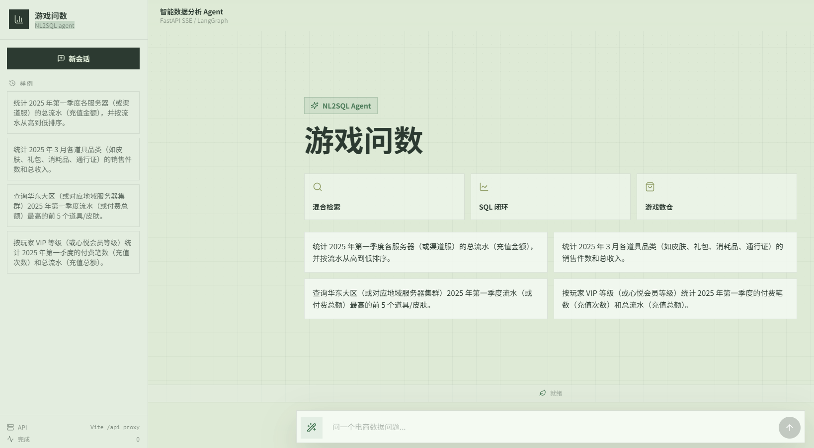
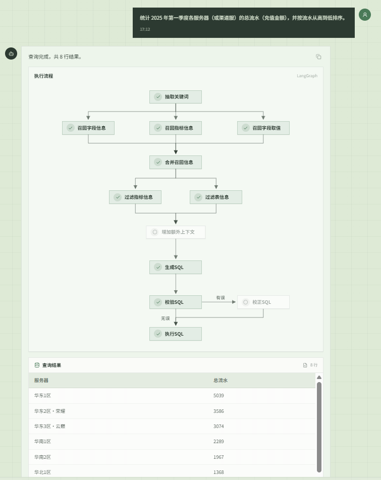

<div align='center'>
  <h1 style="margin-top: 15px;">「游戏问数」智能数据分析 Agent</h1>
  <h4><b>NL2SQL-Agent</b></h4>
  <p><em>一个关于自然语言查询转换为SQL查询的智能问数实战项目，支持混合检索、多阶段推理、SQL 生成与执行全链路</em></p>
</div>

<div align='center'>


</div>


游戏问数不是只调用一次大模型接口，也不是写几个 Prompt 演示 SQL 生成结果。这个项目围绕游戏数仓问数场景，先构建元数据知识库，再做字段、指标、字段取值的混合检索，随后用 LangGraph 编排多阶段问数流程，完成 SQL 生成、校验、修正、执行和前端流式展示。换句话说，这不是某一个框架 API，而是一条 AI 应用从数据准备、检索增强、智能体编排、接口交付到前端联调的完整项目主线。




## 📖 项目介绍

在真实问数场景里，业务同学通常不会写 SQL，数据分析同学也很难随时记住所有表结构、字段含义、指标口径和字段取值。单纯把自然语言问题直接交给大模型，很容易出现表选错、字段选错、指标理解错和 SQL 幻觉等问题。

`游戏问数` 要解决的就是这个问题：

- 用户用自然语言提问
- 系统自动召回相关字段、指标和字段取值
- 大模型基于上下文进行分步推理
- 生成 SQL 并查询数据仓库
- 以流式方式返回分析结果

## ✨ 项目亮点

- **检索 + 推理 + 生成，而不是模型直出 SQL**
    - 先围绕问题召回相关字段、指标和值域，再组织上下文生成 SQL，整体链路更稳、更可控。
- **面向企业问数场景的混合检索**
    - `Qdrant` 负责字段和指标的语义召回。
    - `Elasticsearch` 负责字段取值的全文检索。
    - `MySQL` 负责保存完整、权威的结构化元数据。
- **支持字段、指标、取值三类信息协同召回**
    - 比单纯做表级或字段级检索更贴近真实企业分析流程。
- **从检索到执行的完整可运行链路**
    - 不停留在 Prompt 设计，而是会真实生成 SQL、执行查询，并以流式方式返回结果。
- **工程化后端结构清晰**
    - 基于 `FastAPI + LangGraph + Repository + Client Manager` 组织配置、客户端、仓储层、服务层与智能体流程，便于维护和扩展。

## 🏗️ 系统架构


项目围绕两条主线展开：

| 主线             | 做什么                                                                   | 涉及模块                                     |
| ---------------- | ------------------------------------------------------------------------ | -------------------------------------------- |
| 元数据知识库构建 | 抽取游戏数仓中的表、字段、指标和字段取值，写入结构化库、向量库和全文索引 | `MySQL` / `Qdrant` / `Elasticsearch` / `TEI` |
| 自然语言问数     | 基于用户问题完成召回、上下文整理、SQL 生成校验执行，并把过程流式返回前端 | `LangGraph` / `FastAPI` / `SSE` / `React`    |



## 🛠️ 项目技术栈

| 模块       | 技术                              | 作用                                           |
| ---------- | --------------------------------- | ---------------------------------------------- |
| 游戏数仓   | `MySQL`                           | 模拟事实表、维度表和分析型查询环境             |
| 元数据库   | `MySQL` / `SQLAlchemy`            | 保存表、字段、指标、字段指标关系等结构化元数据 |
| 向量检索   | `Qdrant`                          | 保存字段和指标向量，支持语义召回               |
| 全文检索   | `Elasticsearch`                   | 保存字段真实取值，支持关键词和值域检索         |
| Embedding  | `TEI` / `BAAI/bge-large-zh-v1.5`  | 将字段、指标、问题等文本转成向量               |
| 智能体编排 | `LangGraph`                       | 组织多阶段问数工作流                           |
| 模型接入   | `LangChain`                       | 封装 LLM 与 Embedding 调用                     |
| 后端接口   | `FastAPI`                         | 提供问数 API、依赖注入和生命周期管理           |
| 流式协议   | `SSE`                             | 实时返回节点进度、查询结果和错误消息           |
| 前端       | `React` / `Vite` / `Tailwind CSS` | 提供聊天式问数界面和流程展示                   |
| 日志追踪   | `ContextVar` / `loguru`           | 为并发请求注入 request_id，便于排查链路        |
| 依赖管理   | `uv` / `pnpm`                     | 管理 Python 后端和前端依赖                     |

## 📁 项目结构

```text
NL2SQL-Agent/
├── app/
│   ├── agent/            # LangGraph 图、状态、上下文和各类节点
│   ├── api/              # FastAPI 路由、依赖注入、生命周期和请求结构
│   ├── clients/          # MySQL、Qdrant、Elasticsearch、Embedding 客户端管理
│   ├── conf/             # 配置 dataclass 与配置加载工具
│   ├── core/             # 日志、request_id 上下文等通用能力
│   ├── entities/         # 更贴近业务语义的数据对象
│   ├── models/           # SQLAlchemy ORM 模型
│   ├── prompt/           # Prompt 加载工具
│   ├── repositories/     # MySQL、Qdrant、Elasticsearch 数据访问层
│   ├── scripts/          # 元数据知识库构建脚本
│   └── services/         # 元数据构建服务和问数查询服务
├── conf/                 # app_config.yaml、meta_config.yaml
├── docker/               # Docker Compose、MySQL 初始化 SQL、ES 插件、Embedding 挂载目录
├── frontend/             # React + Vite + Tailwind CSS 前端项目
├── prompts/              # SQL 生成、修正、过滤等 Prompt 模板
├── main.py               # FastAPI 应用入口
└── pyproject.toml        # Python 项目依赖与工具配置
```

## 🚀 快速开始

当前仓库已经包含一套可直接启动的本地开发环境，你可以按照以下顺序启动项目。

### 1. 准备环境

- Python `>= 3.14`
- `uv`
- Docker 与 Docker Compose
- Node.js 与 `pnpm`

### 2. 克隆项目

```bash
git clone https://github.com/losophy/NL2SQL-Agent.git
cd NL2SQL-Agent
```

### 3. 安装后端依赖

```bash
uv sync
```

### 4. 配置大模型 API Key

```bash
cp .env.example .env
```

把 `.env` 中的 `LLM_API_KEY` 替换成真实密钥：

```bash
LLM_API_KEY=your_real_api_key
```

默认配置使用兼容 OpenAI 接口的硅基流动服务：

```yaml
llm:
    model_name: Pro/zai-org/GLM-5.1
    api_key: ${oc.env:LLM_API_KEY}
    base_url: https://api.siliconflow.cn/v1
```

如需使用其他兼容 OpenAI API 的模型平台，修改 [conf/app_config.yaml](conf/app_config.yaml) 中的 `model_name` 和 `base_url`。

### 5. 准备 Embedding 模型

项目通过 `TEI` 加载 `BAAI/bge-large-zh-v1.5`。模型文件体积较大，无法再仓库中进行提交，需要先下载到 Docker 挂载目录：

```bash
uv run hf download BAAI/bge-large-zh-v1.5 --local-dir docker/embedding/bge-large-zh-v1.5
```

如果手动下载，请解压到：`docker/embedding/bge-large-zh-v1.5`路径下。

### 6. 启动 Docker 基础服务

```bash
docker compose -f docker/docker-compose.yaml up -d
```

默认端口：

| 服务          | 端口   |
| ------------- | ------ |
| MySQL         | `3306` |
| Elasticsearch | `9200` |
| Kibana        | `5601` |
| Qdrant        | `6333` |
| Embedding     | `8081` |

> `docker/mysql/meta.sql` 和 `docker/mysql/dw.sql` 会在 MySQL 容器首次启动时自动初始化元数据库和游戏数仓。

### 7. 构建元数据知识库

```bash
uv run python -m app.scripts.build_meta_knowledge -c conf/meta_config.yaml
```

这一步会把表字段元数据写入 MySQL，把字段和指标向量写入 Qdrant，并把字段真实取值写入 Elasticsearch。

### 8. 启动后端

```bash
uv run fastapi dev main.py
```

后端接口：

```text
POST http://127.0.0.1:8000/api/query
```

请求示例：

```json
{
    "query": "统计华北地区的总流水"
}
```

SSE 消息类型：

| 类型       | 含义         |
| ---------- | ------------ |
| `progress` | 节点执行进度 |
| `result`   | 最终查询结果 |
| `error`    | 全局异常消息 |

### 9. 启动前端

```bash
cd frontend
pnpm install
pnpm dev
```

前端默认通过 Vite 代理把 `/api` 转发到 `http://127.0.0.1:8000`。如需修改：

```bash
cd frontend
cp .env.example .env
```

```bash
VITE_DEV_PROXY_TARGET=http://127.0.0.1:8000
```

> 本项目基于didilili「shopkeeper-agent」项目，并在此基础上整理完善。


